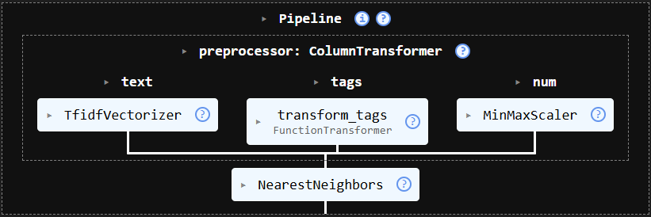
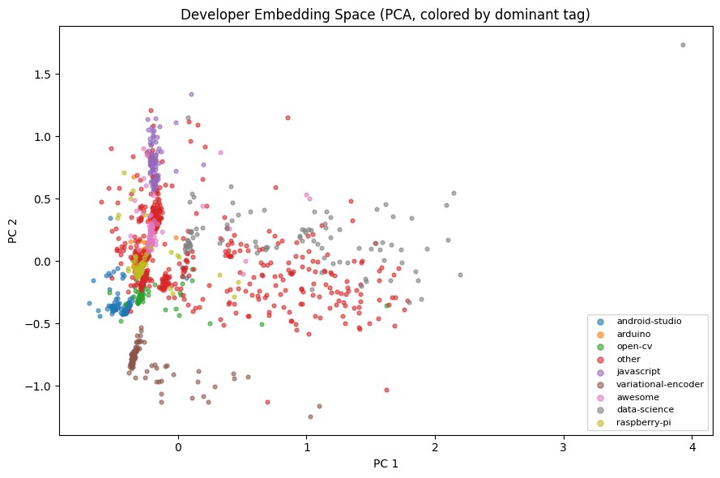

# GitHub Collaborator Recommendation System

This project builds an end-to-end, content-based machine learning system to recommend potential GitHub collaborators based on developer similarity. The system represents developers using aggregated repository metadata and applies an unsupervised similarity model to surface meaningful collaborator recommendations.

The primary goal of this project is to demonstrate a complete scikit-learn ML workflow — from data cleaning and feature engineering to modeling, evaluation, and reproducible artifacts — using real GitHub data.

---

## Dataset

[Dataset Link](https://www.kaggle.com/datasets/vatsalparsaniya/github-repositories-analysis)

The dataset consists of approximately **1,500 GitHub repositories** corresponding to **1,210 unique developers**, sourced from a public Kaggle dataset of highly starred repositories across multiple domains.

Each repository includes:
- textual descriptions
- topic tags
- star and fork counts
- repository ownership information

Repositories are aggregated at the **developer level**, producing one feature representation per developer.

---

## Feature Engineering

Each developer is represented using a combination of semantic and numeric features:

- **Text Features**  
  Repository descriptions are concatenated per developer and vectorized using **TF-IDF** to capture semantic similarity.

- **Tag Features**  
  Repository topic tags are merged and deduplicated per developer, then encoded using **MultiLabelBinarizer**.

- **Numeric Features**  
  Log-transformed star and fork counts are averaged per developer and scaled using **MinMaxScaler**.

These features are combined using a **ColumnTransformer** to produce a unified developer embedding.

---

## Model Architecture

The system uses a fully unsupervised, content-based recommendation approach:

- **Preprocessing**:  
  TF-IDF (text) + MultiLabelBinarizer (tags) + MinMaxScaler (numeric)
- **Similarity Model**:  
  K-Nearest Neighbors (KNN) with **cosine distance**

All preprocessing and modeling steps are encapsulated in a single scikit-learn **Pipeline**.

---
### Pipeline Overview

## Evaluation

Because this is an unsupervised recommendation system with no ground-truth collaborator labels, evaluation is performed using intrinsic and semantic metrics.

### Developer Embedding Visualization

### Quantitative Evaluation
- Mean cosine distance to recommended collaborators: **0.455**
- Mean cosine distance to random developers: **0.884**

Recommended collaborators are nearly **2× closer** in embedding space than random developers.

### Semantic Evaluation
- Mean tag Jaccard similarity: **0.485**
- Median tag Jaccard similarity: **0.3125**

On average, recommended collaborators share nearly **50% of their tags**, indicating strong domain-level coherence.

---

## Example Output

Recommendations for developer: 0xFireball
------------------------------------------------------------
1. dodola
   Cosine distance : 0.0544
   Shared tags     : 1
   Common tags     : ['android-studio']
   Description     : android studio+lldb binder

2. lihei12345
   Cosine distance : 0.0774
   Shared tags     : 1
   Common tags     : ['android-studio']
   Description     : android android studio

3. artem-zinnatullin
   Cosine distance : 0.0844
   Shared tags     : 1
   Common tags     : ['android-studio']
   Description     : jvm options for smoother android studio experience

4. itkacher
   Cosine distance : 0.1694
   Shared tags     : 1
   Common tags     : ['android-studio']
...
   Shared tags     : 1
   Common tags     : ['android-studio']
   Description     : google android studio

   
---

## Reproducibility

The project saves all key artifacts:
- Trained scikit-learn pipeline
- Developer embeddings
- Developer index mapping

This enables reproducible inference and future API deployment.

---

## Tech Stack

- Python
- Pandas, NumPy
- Scikit-learn
- TF-IDF, KNN
- Matplotlib

---

## Future Work

- Interactive recommendation UI
- FastAPI inference endpoint
- Online evaluation with user feedback
- Clustering-based recommendation constraints
